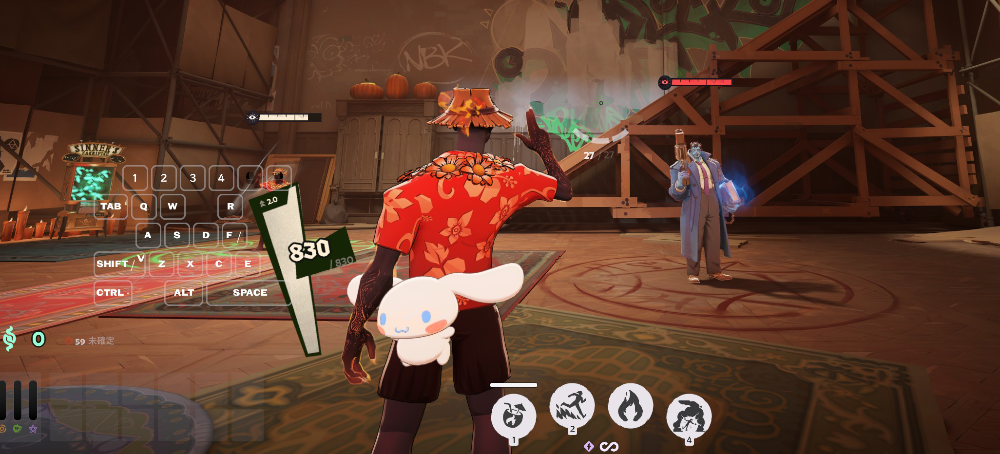
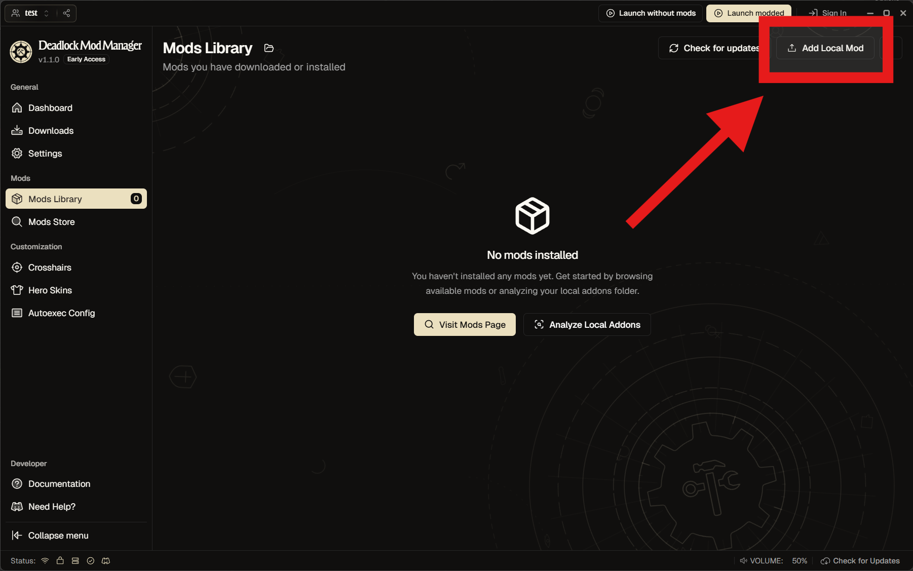
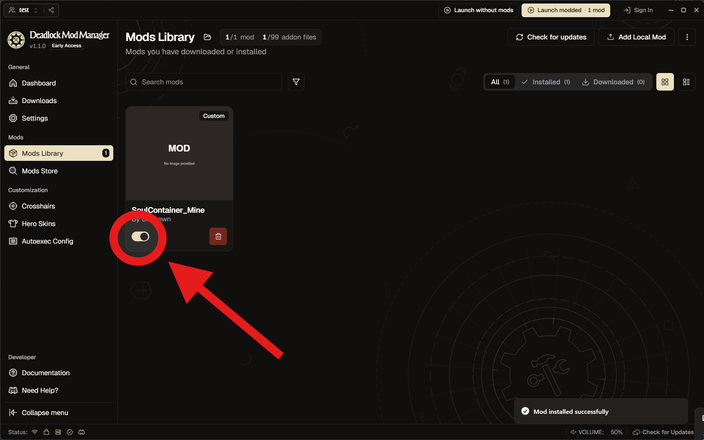

# Deadlock Soul Container Blender Addon

3D モデルを、**Deadlock のソウルコンテナ mod にする** Blender アドオンです。

The English version is in [README.en.md](README.en.md).



---

## 必要なもの

| 必要なもの | 補足 |
|---|---|
| Blender 4.2 以降 | 拡張機能（Extensions）に対応したバージョン |
| Reduced CSDK 12 | Deadlock のコンパイラ一式。[deadlockmodding.pages.dev](https://deadlockmodding.pages.dev/modding-tools/csdk-12) のページ内、Google ドライブから |
| Steam（Deadlock インストール済み） | CSDK が参照します。起動してログインした状態に |
| Deadlock Mod Manager | 作成した mod をゲームに入れるために使います（[deadlockmods.app](https://deadlockmods.app/)） |

---

## インストール

1. [Releases](../../releases) から `deadlock_soul_container-x.y.z.zip` をダウンロードします
2. Blender の **編集 → プリファレンス → アドオン** を開きます
3. 右上の **▼ → Install from Disk** を選びます
4. **手順 1 の zip をそのまま指定します**（展開しないでください）
5. 一覧に現れた「Deadlock Soul Container」にチェックを入れます

### 最初に一度だけ：CSDK の場所を指定する

アドオンに、Reduced CSDK 12 を置いた場所を教えます。

ここを設定しないと mod はビルドできません。

1. **編集 → プリファレンス → アドオン** を開きます
2. 「**Deadlock Soul Container**」の行、左にある **▸** を開きます
3. **CSDK 12 のフォルダ** の欄が現れます
4. 右のフォルダのアイコンを押します
5. `Reduced_CSDK_12` の**フォルダを選び**、「Accept」を押します

```
例: C:\Users\<ユーザー名>\Downloads\Reduced_CSDK_12
     ├─ game\        ← この 2 つが見えているフォルダが正解です
     └─ content\
```

> `game\` と `content\` が**直接見えているフォルダ**を指定してください。
>
> `Reduced_CSDK_12\Reduced_CSDK_12\` のように名前が二重になっている場合は、**内側**が正解です。

この設定は Blender に保存されます。

.blend ファイルを変えても、そのまま使えます。

未設定のときは、「③ mod をビルド」の欄に **「CSDK 12 のフォルダが未設定」** と出ます。

---

## 使い方

3D ビューで **N** キーを押します。

右に現れるタブの「**Soul Container**」を開いてください。

### ① メッシュオブジェクトを選択して実行

モデルを Blender に読み込みます。

**メッシュを 1 つだけ**選択して、**［ソウルコンテナにする］**を押します。

作成されたオブジェクトは、すべて `SoulContainer` コレクションに入ります。

**もう一度押しても作り直しません。**作業中の複製をそのまま使います。

作り直したいときは、生成物を削除してから、もう一度押してください。

### マテリアル（見た目）

パネルの「マテリアル（vmat）」を開きます。

**ベースカラー**などの画像を、ここで指定できます。

マテリアルが無い場合は自動で作成されます。複数のマテリアルにも対応しています。

数値のつまみ（ラフネス・メタリック・自己発光・彩度）も、ここにあります。

### ② チェック

**［チェック］**を押すと、条件を満たしているかが一覧で表示されます。

- ✓ … 問題ありません
- ⓘ … 注意（このまま進められます）
- ✗ … 警告（このままではビルドできません）

### ③ mod をビルド

**mod 名**と**出力先**を決めて、**［mod をビルド］**を押します。

エクスポート → コンパイル → vpk へのパックが、一度に実行されます。

出力先に `<mod 名>.vpk` ができます。

ここまでで mod のファイルは完成です。

あとはゲームに入れるだけです。次の「**Deadlock Mod Manager での操作**」へ進んでください。

---

## Deadlock Mod Manager での操作

Deadlock Mod Manager をインストールします。

**Mods Library → Add local mod** から、作成した vpk をアップロードします。



ひとつ前の画面に戻り、追加した mod を有効化します。



---

## うまくいかないときは

**「コンパイラの上限 524,288 を超えている」と出る**

頂点数が多すぎるとビルドできません。

デシメートモディファイアーなどで減らしてください（適用は不要です）。

**「CSDK 12 が見つからない」**

プリファレンスのフォルダ指定を確認してください。

`game\bin_cs2\win64\resourcecompiler.exe` が存在するフォルダが正解です。

**コンパイラがエラーを返す**

Steam が起動しているかを確認してください。

解決しない場合は、エクスポート先の `compile.log` に生のログが残っています。

---

## このアドオンができないこと

- **ソウルコンテナのみ対応**です。ヒーローのモデル差し替えはできません
- メッシュは **1 つ**だけ扱います（複数まとめたい場合は、Blender 側で結合してください）

---

## 仕組み（AI に渡す用・内部で行っている処理）

ボタンを押したときに何が実行され、なぜそうしているのかをまとめた節です。

**この節をまるごと AI に貼り付けると、不具合の相談や改造の相談がしやすくなります。**

自分で中を読むときの地図としても使えます。

### ［ソウルコンテナにする］

1. **選択したメッシュを複製します。**
   複製はメッシュデータもマテリアルも自分の持ち物にします。
   これ以降の処理（サイズ変更、エクスポート時のマテリアル名の変更）は、元のモデルに影響しません
2. サイズの目安となるワイヤー球（半径 6.325 unit）、ボーン `joint1` 1 本のアーマチュア、
   当たり判定の球を `SoulContainer` コレクションに配置します
3. 親をクリアし、位置・回転・スケールをメッシュに適用します
4. **半径 6.325 unit に合わせます。** 本家のソウルコンテナの大きさです
5. バウンディングボックスの中心を原点へ移動します。そこがキャラクターの手の位置です
6. アーマチュアモディファイアーを追加し、全頂点を `joint1` にウェイト 100% で割り当てます

本家のソウルコンテナは、こういう形をしています。

**1 unit = 1 inch、半径 約 6.3 unit（直径 約 32cm）、ボーンは joint1 の 1 本、
全頂点が joint1 に 100%、当たり判定は半径 7 の球。**

上記の 6 手は、そこへ合わせるための処理です。

### ［mod をビルド］

1. 前回のビルドで出力したファイルを削除します。
   ファイル名はマテリアル名から作られるため、名前が変わると古いファイルが残り、vpk に混入します
2. 選択したメッシュを FBX でエクスポートします。**`global_scale=0.0254`** を指定します。
   Blender は 1 BU を 100cm として書き出し、Source 2 は FBX の cm を inch として読みます。
   指定しないと 1 BU が 39.37 unit になります（部屋いっぱいの大きさです）
3. マテリアルごとに `.vmat` を書き出し、`.vmdl` の置き換え表（`remaps`）に 1 行ずつ並べます。
   雛形は `pbr.vfx` の NPR 設定一式で、値だけを差し替えています
4. `game\bin_cs2\win64\resourcecompiler.exe` でコンパイルします
5. 出力された `*_c` を集めて vpk にまとめます（向き修正のパーティクル 3 つも同梱します）

> ⚠ コンパイラは **`game\bin_cs2\win64\` のもの**しか使用できません。
>
> `bin\` `bin_tools\` `bin_server\` のものは
> `Schema mismatch: resourcecompiler.dll vs particles.dll` で停止します。

### 踏んだ罠

**マテリアル名の `.001` は拡張子として読まれ、マテリアルが外れます。**

赤いワイヤーの玉になります。

エクスポートの間だけ、半角英数の名前に変更しています。

Blender は名前の重複を自動的に避けるため、同名になるものを一時退避し、仮の名前を経由して本来の名前に変更します。狙いどおりになったかを確認してから、エクスポートします。

**テクスチャの辺が 2 の累乗でないと、ノーマル／ラフネスのミップ生成に失敗します。**

`Cannot filter non-power-of-two texture 1200x1024x1!` というエラーになります。

vmat ごとコンパイルが失敗し、表示される警告は「メッシュがマテリアルを参照できない」です。**原因から 2 段離れた内容**になります。

エクスポート時に、近いサイズへリサイズして渡しています。Blender 内の画像は変更しません。

**頂点数の上限は 524,288 です。**

スキン付きメッシュが GPU の頂点キャッシュを使用するためです。

チェックが数えるのは**エクスポートされる頂点数**です。デシメートモディファイアーは、適用しなくても反映されます。

**`obj.bound_box` と `matrix_world` は、依存グラフが更新されるまで古い値を返します。**

計測の前に `view_layer.update()` を挟み、大きさは頂点から直接測っています。

### 向き修正のパーティクル

ソウルコンテナは、**モデルではなくパーティクルが描画しています**。

`particles/generic/holding_gold_neutral_model.vpcf` です。

そのため、モデルを差し替えただけでは、キャラクターの向きに追従しません。

元のパーティクルが `C_OP_PositionLock` の `m_bLockRot` で回転を固定しているためです。

これを修正したパーティクル 3 つを同梱しています。

手法は [mod 657811](https://gamebanana.com/mods/657811) の作者からお借りしました。

設定で外すこともできます。

ヨー（水平方向）のみの補正のため、しゃがみ移動では違和感が残ります。

Valve のモデルやテクスチャは**同梱していません**。サイズガイドの球は、アドオンが実行時に生成しています。

---

## サポートについて

個人が趣味で作ったものです。

**無保証・サポートなし**でお使いください。

問い合わせの窓口は設けていません（Issues も受け付けていません）。

MIT ライセンスなので、**自由に改変・再配布していただけます**。

手元で直したほうが早い箇所があれば、そのまま直してお使いください。

---

## ライセンス

MIT ライセンスです。詳しくは [LICENSE](LICENSE) をご覧ください。
